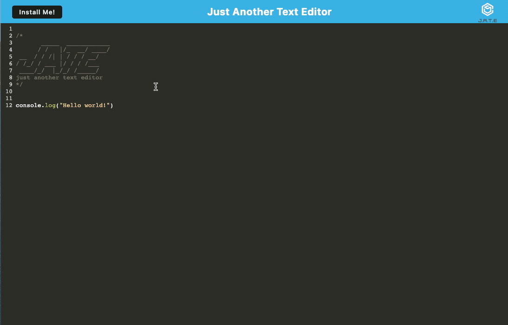

# Text Editor 

## Description
JATE is a web application that serves as a text editor with offline capabilities. It allows users to create and edit text content even when they are not connected to the internet. The application utilizes IndexedDB for local storage. Additionally, JATE is a Progressive Web App (PWA) that can be installed on desktops and mobile devices for easy access.

## Table of Contents

- Description
- Table of Contents
- Installation
- Usage
- Technology
- Questions
- Link
- Screenshot

## Installation
1. Clone the repository: `https://github.com/sarahizar/Text_Editor.git`
2. Navigate to the project directory: `cd JATE`
3. Install server and client dependencies: `npm run install`
4. Start the development server: `npm run start:dev`

## Usage 
Once the application is running, you can access it by opening a web browser and navigating to `http://localhost:3000`. You can create, edit, and save text content directly within the application. Content is automatically saved to IndexedDB, allowing you to access it even when offline. 

## Technology
- React
- Webpack
- Express.js
- IndexedDB
- Nodemon

## Questions 
If you have any questions, please feel free to reach out:
- GitHub: [sarahizar](https://github.com/sarahizar)
- Email: sara.hizar@outlook.com

## Link
https://github.com/sarahizar/Text_Editor

## Screenshot

